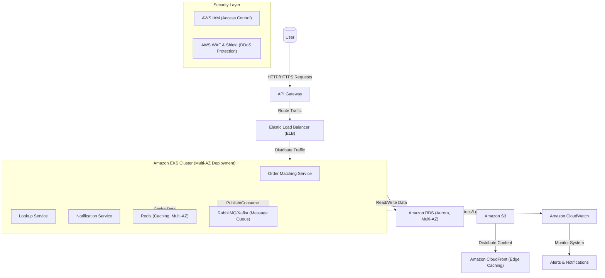

# Problem 2: Building Castle In The Cloud

## Overview

The objective is to design a highly available, scalable, and cost-effective trading system inspired by the Binance platform. The system must handle a throughput of **500 requests per second** with a **p99 response time of less than 100ms**, ensuring resilience to failures and the ability to scale dynamically with increasing demand.

This solution adopts a cloud-native architecture using **Amazon Web Services (AWS)** as the cloud provider. The design prioritizes three core features:
1. **Order Matching System**: A high-performance engine for processing buy/sell orders.
2. **Lookup System**: A service for retrieving real-time market data, such as prices and trade history.
3. **Notification System**: A mechanism for delivering real-time updates to users regarding order status and market events.

The architecture leverages **Amazon EKS** for container orchestration, enabling flexible and scalable deployment of workloads such as order matching, caching, and message queuing. **Amazon RDS (Aurora)** is used for relational data storage, while **Redis** provides low-latency caching, and **RabbitMQ/Kafka** supports reliable message queuing. To ensure **high availability**, critical components are deployed across multiple Availability Zones (Multi-AZ), with failover mechanisms such as Aurora Multi-Master for databases. Additionally, cost optimization is achieved through strategies like utilizing **Spot Instances** or **Reserved Instances** for non-critical workloads.

This design adheres to AWS best practices, balancing performance, scalability, and cost-effectiveness while maintaining fault tolerance and high availability.

Below is the revised version of your content, optimized for clarity, professionalism, and conciseness while maintaining the academic tone suitable for a senior-level assessment. The focus is streamlined to emphasize the **Architecture Diagram** and its components.

---

## Architecture Diagram

### Key Enhancements to the Diagram
1. **Multi-AZ Deployment**: Added annotations to indicate that critical components such as **EKS**, **RDS**, and **Redis** are deployed across multiple Availability Zones (AZs) to ensure high availability and fault tolerance.
2. **Edge Caching**: Integrated **CloudFront** into the architecture to demonstrate the distribution of static content from **S3**, reducing latency for end users through edge caching.

---

### Component Descriptions

#### 1. **API Gateway**
- **Role**: Acts as the entry point for all user requests, handling authentication, rate limiting, and request routing.
- **Rationale**: Chosen for its managed scalability, security features, and seamless integration with AWS services.
- **Alternatives**: Application Load Balancer (ALB) lacks advanced API management capabilities, while custom solutions increase complexity.

#### 2. **Elastic Load Balancer (ELB)**
- **Role**: Distributes incoming traffic across EKS pods to ensure high availability and fault tolerance.
- **Rationale**: Automatically scales with traffic and integrates natively with AWS services.
- **Alternatives**: HAProxy/Nginx require manual setup and maintenance.

#### 3. **Amazon EKS (Compute Layer)**
- **Role**: Orchestrates containerized workloads, including the Order Matching Service, Lookup Service, and Notification Service.
- **Rationale**: Kubernetes provides robust orchestration, while EKS eliminates the operational burden of managing the control plane.
- **Alternatives**: Amazon ECS is less flexible, and AWS Lambda is unsuitable for stateful or long-running workloads.

#### 4. **Order Matching Service**
- **Role**: Processes buy/sell orders with low latency (<100ms p99).
- **Rationale**: Deployed on EKS for scalability and written in high-performance languages like Go or Rust.
- **Alternatives**: Monolithic architectures limit scalability, and serverless functions introduce cold-start latency.

#### 5. **Lookup Service**
- **Role**: Retrieves real-time market data (e.g., prices, trade history).
- **Rationale**: Utilizes Redis caching to reduce database load and improve response times.
- **Alternatives**: Direct database queries increase latency, and static file storage lacks real-time capabilities.

#### 6. **Notification Service**
- **Role**: Sends real-time updates to users via RabbitMQ/Kafka.
- **Rationale**: Decouples event producers and consumers, ensuring reliable delivery under high load.
- **Alternatives**: Direct messaging creates tight coupling, and third-party services add costs.

#### 7. **Redis (Caching)**
- **Role**: Caches frequently accessed data (e.g., market prices) to reduce database load.
- **Rationale**: In-memory caching ensures sub-millisecond latency.
- **Alternatives**: Amazon ElastiCache increases costs, and local caching leads to inconsistency.

#### 8. **RabbitMQ/Kafka (Message Queue)**
- **Role**: Facilitates asynchronous communication between services.
- **Rationale**: Decouples services, improving scalability and fault tolerance.
- **Alternatives**: Amazon SQS/SNS lacks advanced features, and custom queues increase complexity.

#### 9. **Amazon RDS (Aurora)**
- **Role**: Stores structured data (e.g., user data, order history).
- **Rationale**: Offers high performance, scalability, and MySQL/PostgreSQL compatibility.
- **Alternatives**: DynamoDB lacks complex query support, and self-managed databases increase operational overhead.

#### 10. **Amazon S3**
- **Role**: Stores static files (e.g., logs, backups).
- **Rationale**: Provides durable, cost-effective, and scalable storage.
- **Alternatives**: EFS is more expensive, and local storage lacks durability.

#### 11. **Amazon CloudWatch**
- **Role**: Collects metrics and logs for real-time monitoring and alerting.
- **Rationale**: Fully integrated with AWS services and provides actionable insights.
- **Alternatives**: Third-party tools (e.g., Datadog) incur additional costs, and custom solutions increase complexity.

#### 12. **Amazon CloudFront**
- **Role**: Distributes static content globally via edge caching.
- **Rationale**: Reduces latency by caching content closer to users.
- **Alternatives**: Other CDNs (e.g., Akamai, Fastly) may involve higher costs.

## Scalability Plan

To ensure the trading system can efficiently handle increased user demand, a robust scalability strategy has been designed. This plan leverages **horizontal scaling** (adding resources) and **vertical scaling** (enhancing resource capacity) through AWS managed services and Kubernetes-native capabilities.

### 1. **Compute Layer Scaling (Amazon EKS)**

- **Horizontal Pod Autoscaler (HPA):**
  - Automatically adjusts pod counts based on CPU/memory usage or custom metrics (e.g., request latency).
  - Example: During peak trading hours, HPA scales pods in the Order Matching Service to manage higher loads.

- **Cluster Autoscaler:**
  - Dynamically provisions worker nodes in the EKS cluster to meet pod scheduling demands, ensuring optimal resource allocation.

- **Scaling Strategy:**
  - Use **AWS Fargate** for burstable workloads (e.g., Notification Service) to simplify EC2 management.
  - For steady-state workloads (e.g., Order Matching Service), deploy EC2-based worker nodes with reserved instances for cost efficiency.

- **Auto Scaling Groups (ASG):**
  - Utilize ASGs to automatically scale EC2 instances or pods in EKS based on system load, ensuring consistent performance.

### 2. **Database Scaling (Amazon RDS Aurora)**

- **Read Replicas:**
  - Deploy up to 15 Aurora read replicas across multiple Availability Zones (AZs) to distribute read traffic effectively.
  - Particularly advantageous for the Lookup Service, which frequently queries market data.

- **Database Sharding:**
  - Partition data across multiple database instances for write-heavy workloads (e.g., order matching). Sharding keys include user IDs or order types to optimize performance.

- **Backup and Recovery:**
  - Enable automated backups and point-in-time recovery to maintain data integrity during scaling operations.

### 3. **Caching Scaling (Redis)**

- **Redis Cluster Mode:**
  - Deploy Redis in cluster mode to enable horizontal scaling, automatically sharding data across nodes for high availability and performance.

- **Auto-scaling:**
  - Monitor Redis memory usage and dynamically scale instances using Kubernetes HPA.

### 4. **Message Queue Scaling (RabbitMQ/Kafka)**

- **Partitioning:**
  - Kafka supports partitioning to distribute messages across brokers for parallel processing. Increase partitions as message volume grows.

- **Consumer Groups:**
  - Scale the number of consumers in Kafka consumer groups or deploy additional RabbitMQ queues and workers to handle increased loads.

### 5. **Load Balancer Scaling (ELB)**

- **Elastic Load Balancer (ELB):**
  - Automatically distributes requests across pods in the EKS cluster as traffic increases.
  - Use **Application Load Balancer (ALB)** for HTTP/HTTPS traffic and **Network Load Balancer (NLB)** for TCP/UDP traffic if required.

### 6. **Storage Scaling (Amazon S3)**

- **S3 Auto-scaling:**
  - S3 provides inherent scalability with virtually unlimited storage capacity. Lifecycle policies transition older data (e.g., logs, backups) to cost-effective storage classes like S3 Glacier.

### 7. **Monitoring and Alerts**

- **CloudWatch Metrics:**
  - Monitor key metrics (e.g., CPU/memory usage, request latency, database connections) to identify bottlenecks.
  - Configure CloudWatch alarms to trigger auto-scaling actions or notify administrators when thresholds are exceeded.

- **Custom Metrics:**
  - Leverage custom metrics (e.g., order processing time, cache hit rate) to refine scaling policies.

### Additional Considerations

- **Multi-region Deployment:**
  - To ensure high availability, deploy the system across multiple AWS regions. Use Route 53 for intelligent traffic routing based on latency or failover policies.

## Performance Evaluation and Optimization Plan

To address the current gap in providing evidence that the system architecture meets the performance requirements (`p99 response time < 100ms` and handling `500 requests per second`), the following evaluation and optimization steps are proposed:

### **1. Performance Benchmarking**
To establish a baseline for system performance, benchmarks will be conducted for critical services, including:
- **Order Matching Service**: Target latency of **20ms/request**.
- **Lookup Service**: Target latency of **30ms/request**.
- **Notification Service**: Target latency of **10ms/request**.

These benchmarks will be executed using tools such as **AWS Load Testing** or **Apache JMeter**, simulating peak workloads (e.g., 500 requests per second) to measure **p99 latency** under stress conditions. Results will validate whether the architecture meets the required thresholds.

### **2. Latency Optimization**
To achieve sub-100ms response times, the following strategies will be implemented:
- **Caching with Redis**: Frequently accessed data will be cached in **Redis** to reduce database query overhead and ensure low-latency responses.
- **Message Queuing with RabbitMQ/Kafka**: Asynchronous processing will be enabled for non-critical tasks, reducing synchronous request load and improving throughput.
- **Edge Caching with CloudFront**: A **CloudFront CDN** will be deployed to cache static and semi-dynamic content at edge locations, minimizing latency for geographically distributed users.

These optimizations will collectively enhance system responsiveness and ensure compliance with the p99 latency requirement.

### **3. Scalability Validation**
The system's ability to scale horizontally will be tested under high-load scenarios:
- **EKS Worker Nodes**: Horizontal scaling of Kubernetes worker nodes will be validated to ensure resource availability during traffic spikes.
- **RDS Aurora**: The database's scalability will be assessed to confirm its capacity to handle increased query loads without performance degradation.
- **Kubernetes HPA**: The effectiveness of the **Horizontal Pod Autoscaler (HPA)** will be evaluated to ensure dynamic resource allocation based on real-time demand.

### **4. Continuous Improvement**
To maintain long-term performance and reliability:
- **Periodic Stress Testing**: Regular stress tests will be conducted to identify potential bottlenecks and refine system performance.
- **Real-Time Monitoring**: **Amazon CloudWatch** will be used to monitor key metrics, detect anomalies, and trigger automated remediation actions.

Here is the revised version of your content, tailored to a senior-level test or academic report with a concise, professional tone. The focus remains on the `High Availability Strategy`, and the language has been refined for clarity and precision.

## High Availability Strategy

Ensuring high availability is critical for a trading system, where downtime or delays can lead to significant financial losses and user dissatisfaction. Below is a structured strategy to achieve fault tolerance, redundancy, and resilience across all components.

#### **1. Multi-AZ Deployment**
- **Amazon EKS**: Deploy worker nodes across multiple Availability Zones (AZs) within an AWS region. Kubernetes ensures automatic rescheduling of pods on healthy nodes during failures.
- **Amazon RDS Aurora**: Utilize Aurora's native multi-AZ replication and failover mechanism to maintain database availability during AZ outages.
- **Elastic Load Balancer (ELB)**: Distribute traffic across AZs, routing requests only to healthy instances.

#### **2. Redundancy at Every Layer**
- **Compute Layer**: Run multiple replicas of each service (e.g., Order Matching, Lookup, Notification) within the EKS cluster. Use Kubernetes liveness and readiness probes for automated health monitoring.
- **Caching Layer (Redis)**: Deploy Redis in cluster mode with master-slave replication across AZs. Enable automatic failover to promote slave nodes to master during failures.
- **Message Queue (Kafka/RabbitMQ)**: Ensure message durability by deploying brokers/nodes across AZs with replication enabled.

#### **3. Disaster Recovery Plan**
- **Database Backups**: Enable automated backups and point-in-time recovery for Aurora. Store backups in Amazon S3 with cross-region replication for additional redundancy.
- **Cross-Region Replication**: Use Aurora Global Database or S3 Cross-Region Replication to replicate critical data to a secondary AWS region. Deploy a standby EKS cluster in the secondary region for regional failover.
- **Failover Testing**: Conduct regular failover drills to validate the effectiveness of the disaster recovery plan and ensure minimal disruption during actual incidents.

#### **4. Chaos Engineering**
- Implement chaos engineering practices to simulate failures and test the system's resilience. Tools like AWS Fault Injection Simulator can be used to intentionally disrupt services and evaluate recovery mechanisms.

#### **5. Load Balancing and Failover**
- **Elastic Load Balancer (ELB)**: Continuously monitor backend instance health and route traffic only to healthy targets.
- **DNS Failover**: Use Amazon Route 53 with DNS failover policies to redirect traffic to the secondary region during regional outages.

#### **6. Monitoring and Alerts**
- **CloudWatch Alarms**: Set up alarms to detect anomalies such as high latency, increased error rates, or resource exhaustion. Trigger automated remediation actions when thresholds are breached.
- **Service Health Dashboards**: Monitor service health using Kubernetes dashboards and CloudWatch metrics. Implement custom alerts for critical components like the Order Matching Service and Redis cache.

#### **7. Graceful Degradation**
- **Fallback Mechanisms**: Design fallback strategies, such as querying the database directly if Redis becomes unavailable, to ensure continued operation with higher latency.
- **Retry Logic**: Implement retry logic with exponential backoff for transient failures.

#### **8. Security and DDoS Protection**
- **AWS WAF & Shield**: Use AWS WAF to block malicious traffic and enable AWS Shield Advanced for DDoS protection.
- **IAM Policies**: Enforce least privilege access using AWS IAM policies to minimize the impact of compromised credentials.

Here is the revised version of your content, tailored to a senior-level test or academic report with a concise, professional tone. The focus remains on the `Architecture Diagram`, and the language has been refined for clarity and precision.

---

## Cost Optimization

Building a cost-effective system is essential for ensuring the financial sustainability of the trading platform while maintaining high performance and scalability. Below is a structured approach to optimizing costs across all architectural components.

### **1. Compute Layer (Amazon EKS)**

- **Right-Sizing Instances**:
  - Analyze resource utilization using AWS Cost Explorer and Kubernetes metrics to adjust instance sizes appropriately.
  - Select instance types that align with workload requirements (e.g., compute-optimized instances for Order Matching).

- **Spot Instances**:
  - Deploy Spot Instances for fault-tolerant workloads (e.g., batch processing, analytics) to reduce compute costs by up to 90% compared to On-Demand pricing.
  - Combine Spot Instances with **AWS Fargate** for burstable workloads like Notification Services.

- **Reserved Instances**:
  - Purchase Reserved Instances for predictable workloads (e.g., core services like Order Matching) to achieve savings of up to 75%.

- **Serverless Alternatives**:
  - Use AWS Lambda for short-term or infrequent tasks (e.g., sending notifications) to eliminate idle capacity costs.

### **2. Database (Amazon RDS Aurora)**

- **Serverless Aurora**:
  - Utilize **Aurora Serverless** for variable traffic patterns to scale capacity dynamically and pay only for actual usage.

- **Read Replicas**:
  - Offload read traffic to Aurora read replicas instead of scaling the primary database, reducing costs while improving performance.

- **Storage Optimization**:
  - Leverage Aurora's built-in compression features to minimize storage costs.
  - Archive infrequently accessed data (e.g., historical trades) to **Amazon S3 Glacier** for long-term storage.

### **3. Caching (Redis)**

- **Efficient Cache Usage**:
  - Set appropriate Time-to-Live (TTL) values to prevent unnecessary memory consumption.
  - Use Redis clustering to distribute cache data across nodes, avoiding costly single-node deployments.

- **Auto-scaling**:
  - Dynamically scale Redis nodes based on memory usage using Kubernetes Horizontal Pod Autoscaler (HPA).

### **4. Message Queue (RabbitMQ/Kafka)**

- **Managed Services**:
  - Consider **Amazon Managed Streaming for Apache Kafka (MSK)** or **Amazon SQS/SNS** to reduce operational complexity and costs.

- **Partitioning**:
  - Maximize throughput using Kafka partitioning to avoid additional brokers, minimizing infrastructure expenses.

### **5. Load Balancer (ELB)**

- **Cost-Efficient Load Balancing**:
  - Use **Application Load Balancer (ALB)** for HTTP/HTTPS traffic, as it is more cost-effective than Network Load Balancer (NLB) for most scenarios.
  - Minimize idle connections to reduce hourly charges.

### **6. Storage (Amazon S3)**

- **Lifecycle Policies**:
  - Implement lifecycle policies to transition older data (e.g., logs, backups) to cheaper storage classes like **S3 Standard-IA** or **S3 Glacier**.

- **Data Compression**:
  - Compress files before uploading to S3 to reduce storage costs.

- **Cross-Region Replication**:
  - Limit replication to critical data (e.g., user accounts, order history) to minimize data transfer expenses.

### **7. Monitoring and Alerts (CloudWatch)**

- **Custom Metrics**:
  - Use custom metrics judiciously to avoid excessive CloudWatch costs.
  - Aggregate logs and metrics at the application level before sending them to CloudWatch.

- **Retention Policies**:
  - Set retention periods for logs (e.g., 30 days) and metrics (e.g., 15 months) to balance monitoring needs with cost.

### **8. General Cost Optimization Strategies**

- **AWS Cost Management Tools**:
  - Use **AWS Cost Explorer** and **AWS Budgets** to monitor spending and set alerts for unexpected cost spikes.
  - Leverage **AWS Trusted Advisor** to identify underutilized resources and optimize costs.

- **Resource Tagging**:
  - Tag all AWS resources (e.g., EC2 instances, S3 buckets) to track usage by team, project, or environment.
  - Identify and terminate unused or idle resources using tags.

- **Instance Mix**:
  - Use a combination of On-Demand, Reserved, and Spot Instances based on workload characteristics to optimize costs.

## Assumptions and Trade-offs

hile designing the trading system, several assumptions were made to simplify the architecture and focus on the core requirements. Additionally, trade-offs were considered to balance performance, scalability, cost, and complexity. Below is a detailed breakdown of these assumptions and trade-offs.

Here’s a refined and professional version of your content, tailored for a senior-level assessment. The language is concise, precise, and focused on clarity while maintaining an academic tone suitable for evaluations or reports.

---

## Assumptions and Trade-offs

The design of the trading system incorporates several assumptions to simplify architectural decisions and focuses on balancing performance, scalability, cost-efficiency, and operational complexity. Below is a structured overview of the key assumptions and trade-offs.

---

### **Assumptions**

1. **Workload Characteristics**:
   - Assumes a predictable workload with occasional spikes during peak trading hours.
   - Assumes read-heavy operations (e.g., market data queries) dominate over write-heavy operations (e.g., order placement).

2. **User Base**:
   - Assumes an initial moderate user base with potential for growth.
   - Assumes users are geographically concentrated in a single region (e.g., North America or Asia), enabling region-specific optimizations.

3. **Data Consistency**:
   - Prioritizes strong consistency for critical operations (e.g., order matching) and eventual consistency for non-critical operations (e.g., market data lookups).

4. **Security Requirements**:
   - Assumes adherence to standard security practices (e.g., encryption, IAM policies). Regulatory compliance (e.g., GDPR, PCI-DSS) is not explicitly addressed unless required.

5. **Third-Party Integrations**:
   - Assumes minimal reliance on third-party services, favoring AWS-native solutions for simplicity and cost-effectiveness.

---

### **Trade-offs**

1. **Compute Layer (EKS vs. Serverless)**:
   - **Trade-off**: Amazon EKS provides flexibility and control but introduces operational complexity compared to fully managed serverless solutions like AWS Lambda.
   - **Reasoning**: EKS was chosen to support stateful workloads (e.g., Order Matching Service) and enable fine-grained scaling for low-latency requirements.

2. **Database (Aurora vs. DynamoDB)**:
   - **Trade-off**: Aurora offers relational modeling and transactional integrity but requires more management compared to DynamoDB, which is fully managed and highly scalable.
   - **Reasoning**: Aurora was selected to meet the need for complex SQL queries and transactional consistency.

3. **Caching (Redis on EKS vs. ElastiCache)**:
   - **Trade-off**: Deploying Redis on EKS reduces costs but increases operational overhead compared to Amazon ElastiCache.
   - **Reasoning**: Redis on EKS was chosen to minimize costs while maintaining adequate performance for caching market data.

4. **Message Queue (RabbitMQ/Kafka vs. SQS/SNS)**:
   - **Trade-off**: RabbitMQ/Kafka supports advanced features like message ordering and partitioning but requires manual setup compared to fully managed SQS/SNS.
   - **Reasoning**: RabbitMQ/Kafka was selected for its ability to handle high-throughput, event-driven architectures critical for real-time notifications and order processing.

5. **Load Balancing (ELB vs. API Gateway)**:
   - **Trade-off**: ELB offers low-latency traffic distribution but lacks advanced API management features provided by API Gateway.
   - **Reasoning**: ELB was chosen for its simplicity and cost-effectiveness, as API Gateway would introduce additional latency and costs.

6. **Scalability vs. Complexity**:
   - **Trade-off**: Auto-scaling and multi-AZ deployments enhance availability and scalability but increase architectural complexity.
   - **Reasoning**: The benefits of fault tolerance and scalability outweigh the added complexity for a mission-critical trading platform.

7. **Cost Optimization (Spot/Reserved Instances vs. On-Demand)**:
   - **Trade-off**: Spot Instances and Reserved Instances reduce costs but may lead to interruptions (Spot) or upfront commitments (Reserved).
   - **Reasoning**: Cost savings were prioritized, as the system is designed to handle interruptions gracefully.

8. **Monitoring (CloudWatch vs. Third-Party Tools)**:
   - **Trade-off**: CloudWatch provides integrated monitoring but lacks advanced features offered by third-party tools like Datadog or New Relic.
   - **Reasoning**: CloudWatch was chosen for its seamless integration with AWS services and lower cost.

---

### **Summary of Assumptions and Trade-offs**

| **Area**               | **Assumption/Trade-off**                                     | **Impact**                                |
|-------------------------|-------------------------------------------------------------|-------------------------------------------|
| Compute Layer           | EKS vs. Lambda                                              | Higher complexity, better control         |
| Database                | Aurora vs. DynamoDB                                         | Strong consistency, higher management     |
| Caching                 | Redis on EKS vs. ElastiCache                                | Lower cost, higher operational overhead   |
| Message Queue           | RabbitMQ/Kafka vs. SQS/SNS                                  | Advanced features, higher complexity      |
| Load Balancing          | ELB vs. API Gateway                                         | Simpler, lower latency                    |
| Scalability             | Auto-scaling vs. static provisioning                        | Higher complexity, better scalability     |
| Cost Optimization       | Spot/Reserved Instances vs. On-Demand                      | Lower cost, potential interruptions       |
| Monitoring              | CloudWatch vs. Third-Party Tools                            | Integrated, fewer advanced features       |

These assumptions and trade-offs ensure the system aligns with critical requirements while addressing potential limitations in a balanced manner.

## Conclusion

The proposed architecture for the trading system effectively addresses the core requirements of high availability, scalability, and cost optimization while adhering to AWS best practices. By leveraging key components such as the **Order Matching System**, **Lookup Service**, and **Notification System**, the design ensures a robust, cloud-native platform tailored for modern trading demands.

### Key Strengths
The architecture excels in several critical areas:
- **High Availability**: Achieved through multi-AZ deployments, automated failover mechanisms, and comprehensive disaster recovery strategies.
- **Scalability**: Enabled by horizontal scaling with Kubernetes HPA, Aurora read replicas, and Redis clustering, ensuring seamless handling of increased workloads.
- **Cost Efficiency**: Optimized through the strategic use of Spot Instances, Reserved Instances, and resource-efficient configurations without compromising performance.

### Future Enhancements
To further enhance the system, future developments could focus on:
- Integrating AI/ML capabilities to analyze user behavior and improve decision-making processes.
- Strengthening security with advanced features such as anomaly detection and real-time threat monitoring.

While deliberate trade-offs were made to balance complexity, performance, and cost, the architecture prioritizes low latency, fault tolerance, and reliability—essential attributes for a trading platform. Grounded in practical considerations, this design provides a solid foundation for sustainable growth and adaptability to evolving business needs.

In conclusion, the proposed solution demonstrates a deep understanding of cloud architecture principles and AWS capabilities, positioning the system to scale effectively with user demand while maintaining exceptional performance and reliability standards.